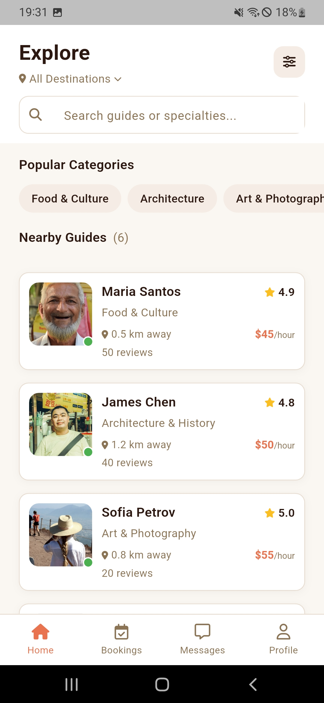
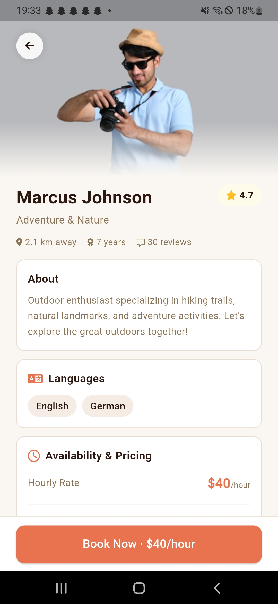
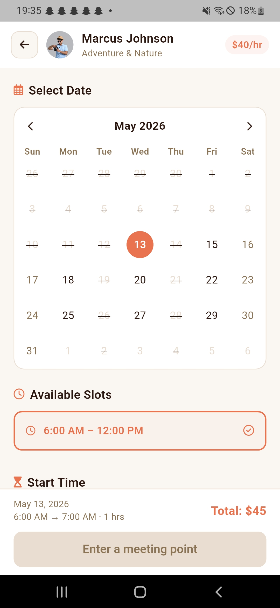
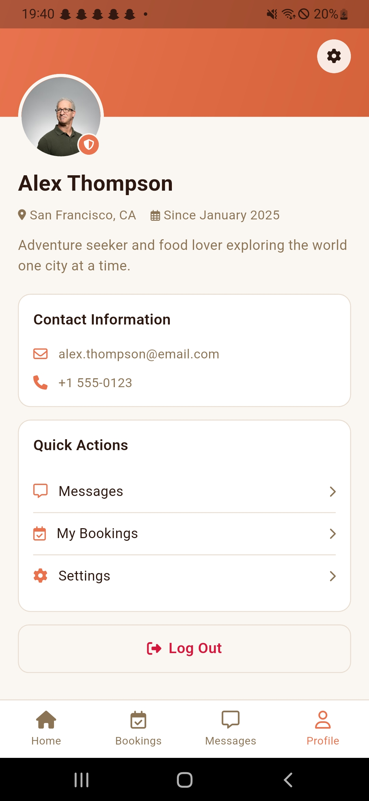
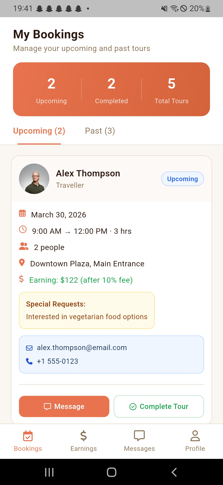
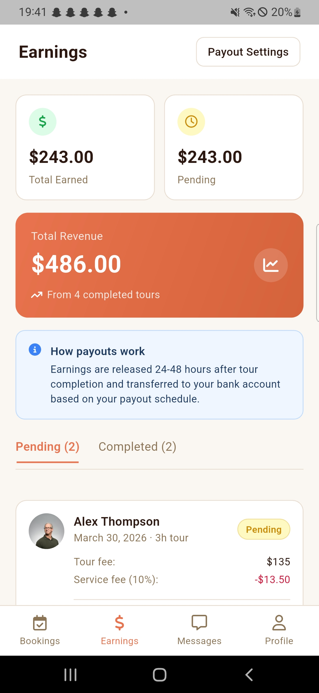
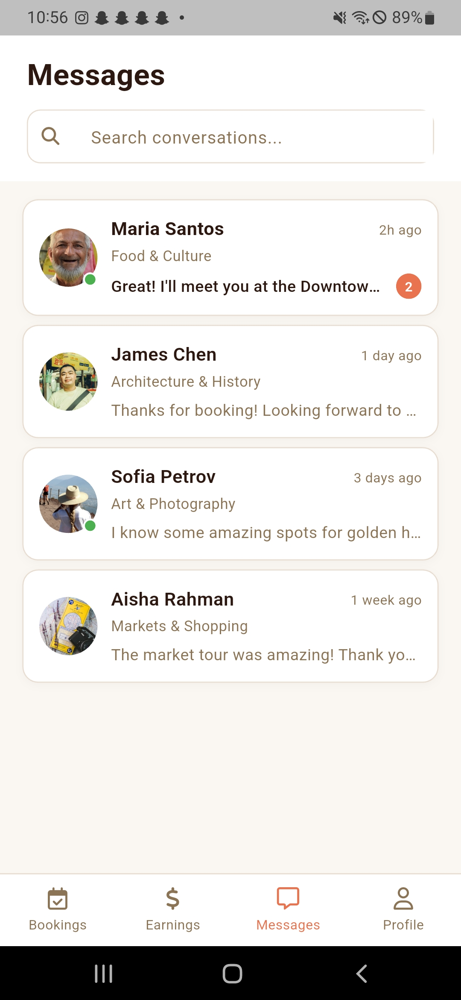
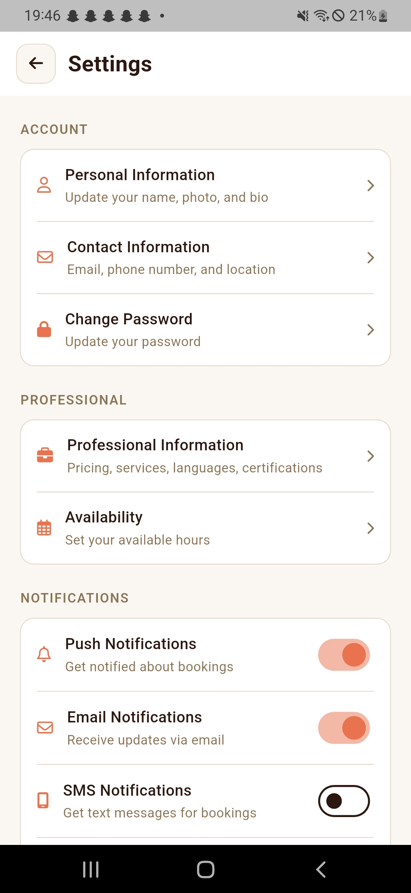

# LocalLead — Find Your Local Guide

A Flutter mobile application that connects travellers with verified local guides for authentic, personalised tour experiences.

---

## Overview

LocalLead is a two-sided marketplace mobile app built with Flutter. Travellers can discover and book local guides based on specialty, location, availability and reviews. Guides can manage their profile, bookings, availability and earnings through a dedicated guide dashboard.

---

## Screenshots

**Travellers**
<table>
  <tr>
    <td></td>
    <td></td>
    <td></td>
    <td></td>
  </tr>
  <tr>
    <td align="center">Explore</td>
    <td align="center">Guide Profile</td>
    <td align="center">Booking</td>
    <td align="center">Profile</td>
  </tr>
</table>

**Guide**
<table>
  <tr>
    <td></td>
    <td></td>
    <td></td>
    <td></td>
  </tr>
  <tr>
    <td align="center">My bookings</td>
    <td align="center">Earnings</td>
    <td align="center">Messages</td>
    <td align="center">Settings</td>
  </tr>
</table>


---

## Features

### Traveller Side
- Browse and search local guides by specialty, location, language and price
- View detailed guide profiles with gallery, tour memories, reviews and weekly availability
- Book guides with real-time slot selection based on guide availability
- Group booking with automatic discounts (10% for 3+ people, 15% for 5+ people)
- Add meeting point and special requests during booking
- View and manage upcoming and past bookings
- Cancel bookings with confirmation
- Write reviews for completed tours
- Real-time messaging with guides

### Guide Side
- Dedicated guide dashboard with earnings overview
- Manage incoming bookings — view traveller details, meeting point and special requests
- Complete tour validation (only after booking end time has passed)
- Set weekly availability with multiple time slots per day
- Manage gallery photos and tour memories
- View all reviews with rating distribution
- Earnings tracking with platform fee breakdown
- Edit professional details — hourly rate, languages, certifications, specialties

### Shared
- Role-based navigation (Traveller / Guide)
- Unified profile screen with role-aware content
- Profile settings — personal info, contact, professional details, availability, payment methods
- Payment method management with card type detection
- Secure logout with confirmation dialog

---

## Tech Stack

| Technology | Purpose |
|---|---|
| Flutter | Cross-platform mobile framework |
| Dart | Programming language |
| Provider | State management |
| go_router | Navigation and routing |
| table_calendar | Booking calendar |
| font_awesome_flutter | Icons |
| google_fonts (Poppins) | Typography |
| image_picker | Photo selection from device |

---

## Project Structure

```
lib/
├── core/
│   ├── constants/
│   │   ├── app_colors.dart
│   │   └── app_fonts.dart
│   ├── providers/
│   │   └── user_provider.dart
│   ├── router/
│   │   └── app_router.dart
│   ├── theme/
│   │   └── app_theme.dart
│   └── utils/
│       └── helpers.dart
├── data/
│   ├── guides_data.dart
│   ├── messages_data.dart
│   └── user_data.dart
├── features/
│   ├── auth/
│   │   └── role_selection_screen.dart
│   ├── splash/
│   │   └── splash_screen.dart
│   ├── traveller/
│   │   ├── explore/
│   │   ├── guide_profile/
│   │   ├── booking/
│   │   ├── messages/
│   │   ├── bookings/
│   │   └── profile/
│   └── guide/
│       ├── bookings/
│       ├── earnings/
│       ├── messages/
│       └── profile/
├── models/
│   ├── user_model.dart
│   ├── guide_model.dart
│   └── booking_model.dart
└── shared/
    ├── screens/
    │   ├── my_reviews_screen.dart
    │   ├── manage_photos_screen.dart
    │   ├── write_review_screen.dart
    │   ├── profile_settings_screen.dart
    │   └── payment_methods_screen.dart
    └── widgets/
        ├── guide_card.dart
        ├── bottom_nav_bar.dart
        └── payment_card_selector.dart
```

---

## Navigation Structure

```
Splash Screen
    └── Role Selection
            ├── Traveller Shell
            │   ├── Explore (Home)
            │   ├── My Bookings
            │   ├── Messages
            │   └── Profile
            └── Guide Shell
                ├── My Bookings
                ├── Earnings
                ├── Messages
                └── Profile

Outside Shell (pushed on top)
    ├── Guide Profile (/guide-profile/:id)
    ├── Booking Details (/booking-details/:id)
    ├── Booking Confirmation (/booking-confirmation)
    ├── Individual Message (/message/:id)
    ├── Profile Settings
    ├── Edit Personal Info
    ├── Edit Availability
    ├── Payment Methods
    ├── My Reviews
    ├── Manage Photos
    └── Write Review
```

---

## Getting Started

### Prerequisites
- Flutter SDK 3.x or higher
- Dart 3.x or higher
- Android Studio or VS Code
- Android emulator or physical device

### Installation

Clone the repository:
```bash
git clone https://github.com/AbikMushyakho/Local-Lead.git
cd local_lead
```

Install dependencies:
```bash
flutter pub get
```

Run the app:
```bash
flutter run
```

### Android Setup

Add permissions to `android/app/src/main/AndroidManifest.xml`:
```xml
<uses-permission android:name="android.permission.READ_MEDIA_IMAGES"/>
<uses-permission android:name="android.permission.READ_EXTERNAL_STORAGE"/>
<uses-permission android:name="android.permission.INTERNET"/>
```

### iOS Setup

Add to `ios/Runner/Info.plist`:
```xml
<key>NSPhotoLibraryUsageDescription</key>
<string>LocalLead needs access to your photos to upload guide gallery images</string>
<key>NSCameraUsageDescription</key>
<string>LocalLead needs access to your camera to take photos for your guide profile</string>
```

---

## Key Design Decisions

| Decision | Reason |
|---|---|
| Provider for state management | Lightweight and sufficient for prototype scale |
| go_router with ShellRoute | Clean bottom nav with nested routing |
| Guide extends User | Proper inheritance — no field duplication |
| Single Booking model | Used for both traveller and guide views |
| weeklyAvailability on Guide model | Real slot-based availability instead of hardcoded Morning/Afternoon/Evening |
| Slot-based booking with start time picker | Supports full day bookings, flexible hours, validates end time within slot |

---

## Known Limitations (Prototype)

- No real backend — all data is hardcoded mock data
- No real authentication — role selection only
- No real payments — Stripe integration not implemented
- No real-time messaging — mock conversations only
- No push notifications — toggles exist but not wired
- Image uploads are device-local only — not persisted to a server
- Settings changes are not persisted — no SharedPreferences

---

## Future Improvements

- Firebase backend integration (Firestore, Auth, Storage)
- Real-time messaging with Firebase Cloud Messaging
- Stripe payment integration
- Location services for nearby guide discovery
- Map view for guide locations
- In-app notifications
- Rating and review system connected to backend
- Guide verification workflow
- Multi-language support

---

## Course Information

- **Subject:** ICT725 User Experience and Mobile Application Development
- **Assessment:** Cross-platform mobile application
- **Framework:** Flutter / Dart

---

## License

© 2026 AbikMushyakho. All rights reserved.

This project and its source code are for educational purposes as part of a university assessment. No part of this project may be reproduced, distributed, or transmitted in any form without prior written permission from the author.